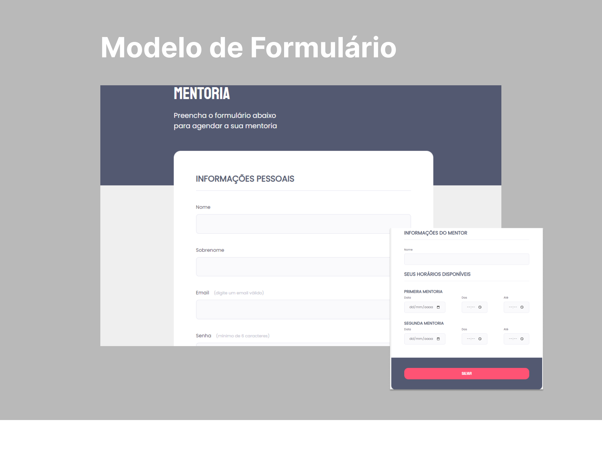

  

<h1 align="center">Desafio Projeto do Explorer - Rocketseat</h1>

Projeto de um formulário.  

 

  
  <a href="https://jlisarte.github.io/projeto_siteformmentoria//" target="_blank">https://jlisarte.github.io/projeto_siteformmentoria/</a>

## 🚀 Tecnologias

Esse projeto foi desenvolvido com as seguintes tecnologias:

- HTML e CSS
- Git e Github
- Figma

## 💻 Projeto

O projeto é um formulário para agendar mentoria.

---

Feito por Shadowkhan - Juliano Lisarte